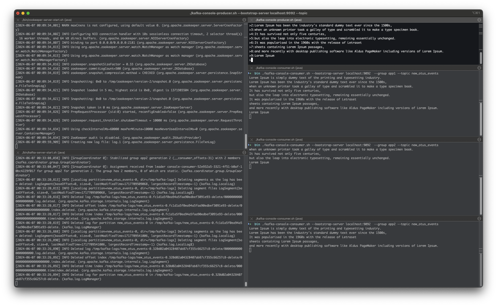

# Домашнее задание

## Запуск Kafka

**Цель:**

Научиться самостоятельно запускать Kafka (быстрый старт).

1. Установить Java JDK
2. Скачать Kafka с сайта kafka.apache.org и развернуть на локальном диске
3. Запустить Zookeeper
4. Запустить Kafka Broker
5. Создать топик test
6. Записать несколько сообщений в топик
7. Прочитать сообщения из топика

## Решение

1. JDK установлена, kafka установлена
2. zookeeper запущен

```shell
./bin/zookeeper-server-start.sh ./config/zookeeper.properties
```

3. kafka запущена

```shell
./bin/kafka-server-start.sh ./config/server.properties
```

4. Создан топик на 10 партиций

```shell
./kafka-topics.sh --bootstrap-server localhost:9092  --topic new_otus_events  --create --partitions 10
```

5. Запущены 3 консьюмера на 3 консолях с двумя разными группами

```shell
./kafka-console-consumer.sh --bootstrap-server localhost:9092  --group app1 --topic new_otus_events
./kafka-console-consumer.sh --bootstrap-server localhost:9092  --group app2 --topic new_otus_events
./kafka-console-consumer.sh --bootstrap-server localhost:9092  --group app2 --topic new_otus_events
```

6. Запущен продюсер с разбором ключа

```shell
./kafka-console-producer.sh --bootstrap-server localhost:9092 --topic new_otus_events --property parse.key=true --property key.separator=:
``` 

Отправлены 9 сообщений:

- 1:Lorem Ipsum is simply dummy text of the printing and typesetting industry.
- 2:Lorem Ipsum has been the industry's standard dummy text ever since the 1500s,
- 3:when an unknown printer took a galley of type and scrambled it to make a type specimen book.
- 4:It has survived not only five centuries,
- 5:but also the leap into electronic typesetting, remaining essentially unchanged.
- 6:It was popularised in the 1960s with the release of Letraset
- 7:sheets containing Lorem Ipsum passages,
- 8:and more recently with desktop publishing software like Aldus PageMaker including versions of Lorem Ipsum.
- 9:Lorem Ipsum

Результат во вложении
