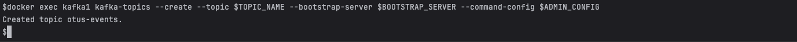
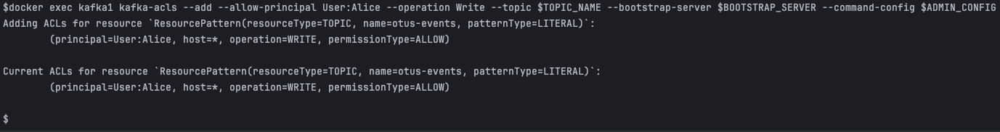
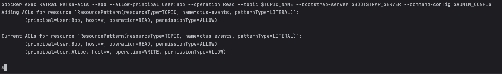
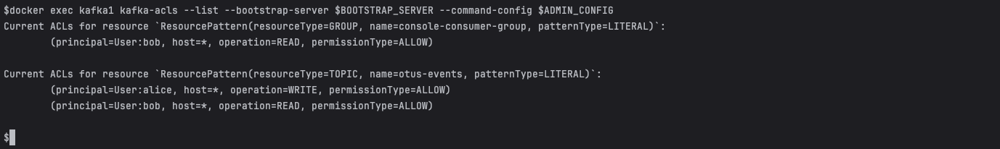
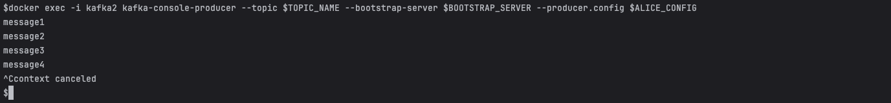
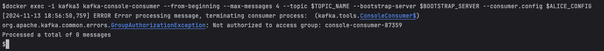
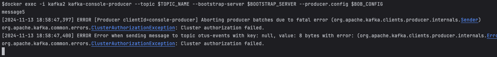
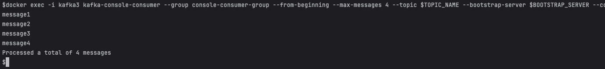
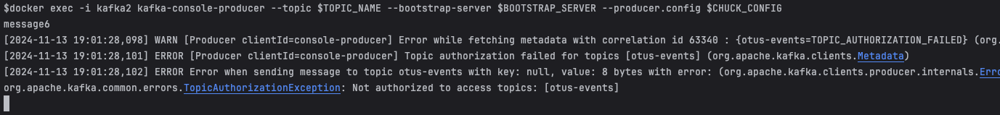
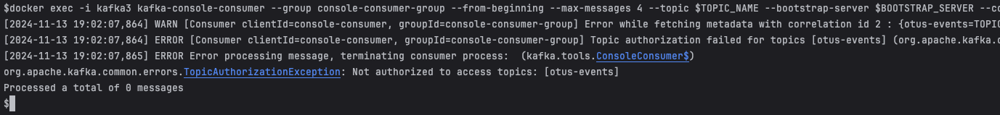

# Домашнее задание

## Kraft и Kafka. Настройка безопасности

**Цель:**

**Научиться разворачивать kafka с помощью kraft и самостоятельно настраивать безопасность.
Описание/Пошаговая инструкция выполнения домашнего задания:**

Развернуть Kafka с KRaft и настроить безопасность:

1. Запустить Kafka с Kraft:
    * Сгенерировать UUID кластера
    * Отформатировать папки для журналов
    * Запустить брокер
2. Настроить аутентификацию SASL/PLAIN. Создать трёх пользователей с произвольными именами.
3. Настроить авторизацию. Создать топик. Первому пользователю выдать права на запись в этот топик. Второму пользователю
   выдать права на чтение этого топика. Третьему пользователю не выдавать никаких прав на этот топик.
4. От имени каждого пользователя выполнить команды:
    * Получить список топиков
    * Записать сообщения в топик
    * Прочитать сообщения из топика

**В качестве результата ДЗ прислать документ с описанием настроек кластера, выполненных команд и снимков экрана с
результатами команд.**

_Дополнительное задание: настроить SSL_

## Решение

### Запускаем кластер kafka c kraft в docker

```shell
docker compose -f ./docker/docker-compose.yml up -d
```

### Аутентификация SASL/PLAIN настроена. Созданы пользователи Alice, Bob, Chuck

```shell
cat ./docker/secrets/kafka_server_jaas.conf
```

### Настраиваем авторизацию

Объявим переменные для удобства

```shell
export BOOTSTRAP_SERVER=kafka1:19092,kafka2:29092,kafka3:39092
export TOPIC_NAME=otus-events
export ADMIN_CONFIG=/etc/kafka/secrets/admin-sasl.properties
export ALICE_CONFIG=/etc/kafka/secrets/alice-sasl.properties
export BOB_CONFIG=/etc/kafka/secrets/bob-sasl.properties
export CHUCK_CONFIG=/etc/kafka/secrets/chuck-sasl.properties
```

#### Создаем топик otus-events

```shell
docker exec kafka1 kafka-topics --create --topic $TOPIC_NAME --bootstrap-server $BOOTSTRAP_SERVER --command-config $ADMIN_CONFIG 
```



#### Проверяем список полномочий

```shell
docker exec kafka1 kafka-acls --list --bootstrap-server $BOOTSTRAP_SERVER --command-config $ADMIN_CONFIG 
```


#### Выдаем права Alice на WRITE

```shell
docker exec kafka1 kafka-acls --add --allow-principal User:alice --operation Write --topic $TOPIC_NAME --bootstrap-server $BOOTSTRAP_SERVER --command-config $ADMIN_CONFIG
```



#### Выдаем права Bob на READ

```shell
docker exec kafka1 kafka-acls --add --allow-principal User:bob --group console-consumer-group --operation Read --topic $TOPIC_NAME --bootstrap-server $BOOTSTRAP_SERVER --command-config $ADMIN_CONFIG
```



#### Пользователь Chuck остается без прав

#### Проверяем список полномочий

```shell
docker exec kafka1 kafka-acls --list --bootstrap-server $BOOTSTRAP_SERVER --command-config $ADMIN_CONFIG 
```



### Выполнение команд от Alice

___

#### Список топиков

```shell
docker exec kafka1 kafka-topics --list --bootstrap-server $BOOTSTRAP_SERVER --command-config $ALICE_CONFIG
```


#### Публикация сообщения

```shell
docker exec -i kafka2 kafka-console-producer --topic $TOPIC_NAME --bootstrap-server $BOOTSTRAP_SERVER --producer.config $ALICE_CONFIG
```



#### Прочитать сообщения

```shell
docker exec -i kafka3 kafka-console-consumer --from-beginning --max-messages 4 --topic $TOPIC_NAME --bootstrap-server $BOOTSTRAP_SERVER --consumer.config $ALICE_CONFIG
```



### Выполнение команд от Bob

___

#### Список топиков

```shell
docker exec kafka1 kafka-topics --list --bootstrap-server $BOOTSTRAP_SERVER --command-config $BOB_CONFIG
```


#### Публикация сообщения

```shell
docker exec -i kafka2 kafka-console-producer --topic $TOPIC_NAME --bootstrap-server $BOOTSTRAP_SERVER --producer.config $BOB_CONFIG
```



#### Прочитать сообщения

```shell
docker exec -i kafka3 kafka-console-consumer --group console-consumer-group --from-beginning --max-messages 4 --topic $TOPIC_NAME --bootstrap-server $BOOTSTRAP_SERVER --consumer.config $BOB_CONFIG
```



### Выполнение команд от Chuck

___

#### Список топиков

```shell
docker exec kafka1 kafka-topics --list --bootstrap-server $BOOTSTRAP_SERVER --command-config $CHUCK_CONFIG
```


#### Публикация сообщения

```shell
docker exec -i kafka2 kafka-console-producer --topic $TOPIC_NAME --bootstrap-server $BOOTSTRAP_SERVER --producer.config $CHUCK_CONFIG
```



#### Прочитать сообщения

```shell
docker exec -i kafka3 kafka-console-consumer --group console-consumer-group --from-beginning --max-messages 4 --topic $TOPIC_NAME --bootstrap-server $BOOTSTRAP_SERVER --consumer.config $CHUCK_CONFIG
```



### Останавливаем кластер

```shell
docker compose -f ./docker/docker-compose.yml down --remove-orphans   
```