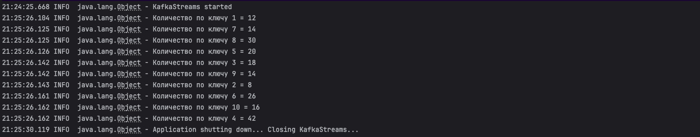

# Домашнее задание

## Разработка приложения Kafka Streams

**Цель:**

**Разработать приложение Kafka Streams.**

Разработка приложения Kafka Streams:

* Запустить Kafka
* Создать топик events
* Разработать приложение, которое подсчитывает количество событий с одинаковыми key в рамках сессии 5 минут
* Для проверки отправлять сообщения, используя console producer.

## Решение

### Запускаем кластер kafka c kraft в docker

```shell
docker compose -f ./docker/docker-compose.yaml up -d
```

### Настраиваем авторизацию

Объявим переменные для удобства

```shell
export BOOTSTRAP_SERVER=kafka1:9092,kafka2:9092,kafka3:9092
export TOPIC_NAME=events
```

### Публикуем события из файла

```shell
docker exec -i kafka3  kafka-console-producer --topic $TOPIC_NAME --bootstrap-server $BOOTSTRAP_SERVER --property  "key.serializer=org.apache.kafka.common.serialization.IntegerSerializer" --property "parse.key=true" --property "key.separator=," <  ./src/main/resources/data.csv
```

### Вывод приложения



### Останавливаем кластер

```shell
docker compose -f ./docker/docker-compose.yaml down --remove-orphans   
```