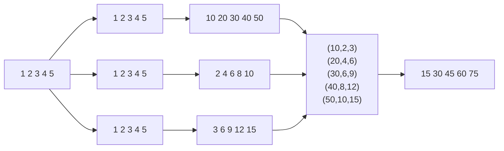
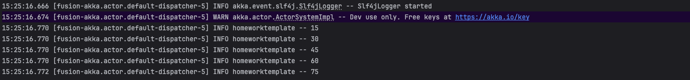

# Домашнее задание

## akka streams, alpakka

**Цель:**

**Закрепить знания, полученные на занятии.**

Описание/Пошаговая инструкция выполнения домашнего задания:**

в репозитории https://github.com/ValentinShilinDe/kafka-mooc-2023-04 есть темплэйт домашней работы
kafka-mooc-2023-04\src\main\scala\akka_akka_streams\homework\homeworktemplate.scala

Задание из 2-х частей:

1. написать граф дсл, где есть какой-то входной поток (целочисленный), он должен быть разделен на 3 (broadcast).

   Первый поток - все элементы умножаем на 10
   Второй поток - все элементы умножаем на 2
   Третий поток - все элементы умножаем на 3
   Потом собираем это все в один поток (zip), в котором эти 3 подпотока должны быть сложены.

2. не обязательно, задача со *. входной поток должен идти из кафки (то есть написать продьюсер, и в консьюмере реализовать
логику из пункта 1)

## Решение

См класс akka_akka_streams.homework.homeworktemplate

